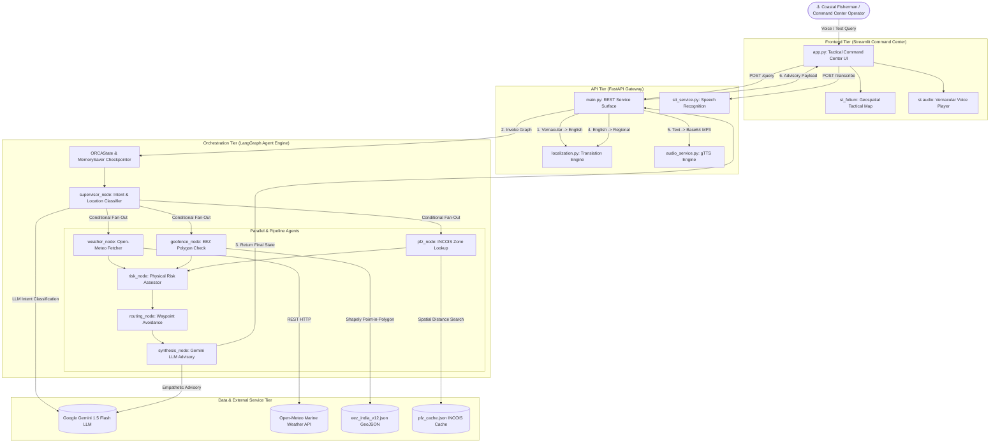
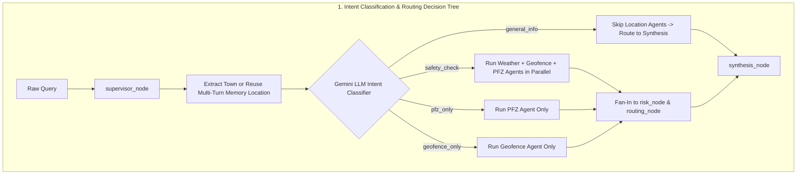
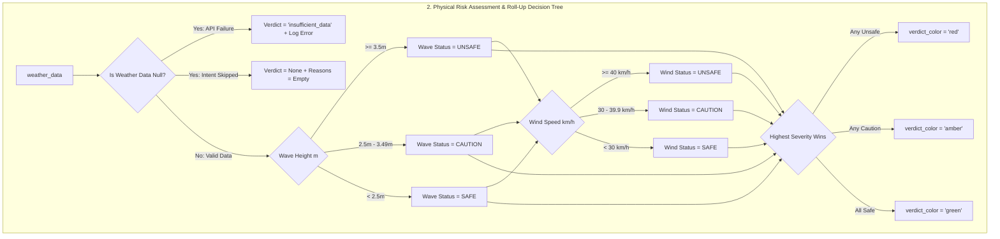

# 🏗️ ORCA System Architecture

> **Project:** ORCA (Ocean Risk & Coastal Advisory Platform)  
> **Purpose:** Technical System Architecture Guide for UI/UX Presentation Designers  
> **Target Tools:** Figma, Canva, Mermaid.js, Lucidchart, or AI Diagram Generators  

---

## 1. High-Level Executive Overview

**ORCA** is an agentic AI marine intelligence and safety platform engineered for Indian coastal fishermen and maritime defense operators. 

The system receives natural-language voice or text queries in multiple Indian languages (Tamil, Telugu, Hindi, Malayalam, Kannada, English) along with real-time GPS coordinates. It passes this input through an intent-driven multi-agent orchestrator powered by **LangGraph**, which coordinates parallel data collection from marine weather services (Open-Meteo), EEZ border geofencing (Marine Regions v12), and Potential Fishing Zone advisories (INCOIS).

The pipeline computes a multi-factor safety risk verdict (Safe / Caution / Unsafe), constructs an explainable evidence provenance trace, generates a waypoint route with hazard-avoidance detours, translates the advisory into the user's regional dialect, synthesizes audio speech, and renders everything on a futuristic Maritime Tactical Command Center interface.



---

## 2. Complete Technology Stack

| Layer | Technology / Library | Purpose & Role |
| :--- | :--- | :--- |
| **Frontend UI** | **Streamlit (`v1.43+`)** | High-density 3-column tactical dashboard layout |
| **Mapping Engine** | **Folium & `streamlit_folium`** | Interactive OpenStreetMap rendering vessel markers, PFZ hotspots, and GeoJSON detour LineStrings |
| **Data Processing** | **Pandas (`v2.2+`)** | Formatting 12-hour sea-state swell and wind forecast datasets |
| **API Framework** | **FastAPI (`v0.115+`) & Uvicorn** | Asynchronous HTTP REST API gateway with Pydantic validation |
| **Agent Framework** | **LangGraph (`v0.2+`)** | StateGraph orchestrator with conditional edges and state reducers |
| **State Memory** | **LangGraph `MemorySaver`** | Session-level state checkpointer enabling multi-turn conversation context |
| **Primary LLM** | **`langchain-google-genai` (Gemini 1.5 Flash)** | Natural language intent classification and empathetic advisory synthesis |
| **Geospatial Math** | **Shapely (`v2.0+`)** | Polygon boundary checks for Indian Exclusive Economic Zone (EEZ) boundaries |
| **Weather Feed** | **Open-Meteo Marine & Weather API** | Live wave height, wind speed, and swell projection time-series |
| **Translation** | **`deep-translator` & Regex Indic Detectors** | Multilingual translation to/from Tamil, Telugu, Hindi, Malayalam, Kannada, English |
| **Text-to-Speech** | **`gTTS` (Google Text-to-Speech)** | Vernacular voice advisory MP3 audio synthesis |
| **Speech-to-Text** | **`SpeechRecognition` & Google STT** | Transcribing uploaded WAV voice recordings to text |

---

## 3. Detailed Component Breakdown

### 3.1 Frontend Tier (`frontend/app.py`)
- **Role:** Presents a Maritime Tactical Command Center interface for fishermen and defense personnel.
- **Key Modules & Panels:**
  - **Top Bar Marquee Ticker:** Renders live push alerts (`PROACTIVE PUSH ALERT`) and stream status.
  - **Column 1 (Comms Link):** Native microphone input (`st.audio_input`), voice transcription connector (`/transcribe`), rapid scenario preset chips (PFZ, IMBL Border, Safe Route, Ecological Diagnostic), multi-turn chat timeline, and speech player (`st.audio`).
  - **Column 2 (Geospatial View):** Center tactical map (`st_folium`), vessel coordinate pin, PFZ target bulls-eye, avoidance detour path, and massive glowing Go/No-Go verdict card (**🟢 SAFE TO PROCEED**, **🟡 CAUTION ADVISED**, **🔴 NO-GO HIGH RISK**).
  - **Column 3 (XAI & Analytics):** 2x2 ocean metric grid (Swell, Wind, Tide, SST), 12-hour sea-state area forecast chart, Ecological Diagnostic card with disclaimer, Explainable AI (XAI) evidence cards, and Data Feed Resilience warning banner.
  - **Sidebar:** Location presets (Mangalore, Palk Strait, Offshore Gale, Chennai), custom Lat/Lon inputs, language selector, session ID reset, and system feeds directory.

### 3.2 API Gateway Tier (`backend/app/main.py`)
- **Role:** Handles client requests, validates schemas, bridges HTTP to LangGraph, and orchestrates localization/voice services.
- **Endpoints:**
  - `POST /query`: Primary endpoint receiving `QueryRequest` (`query`, `lat`, `lon`, `thread_id`) and returning `QueryResponse` (`final_response`, `verdict_color`, `evidence`, `errors`, `detected_language`, `map_geojson`, `forecast_series`, `diagnostic_data`, `audio_base64`).
  - `POST /transcribe`: Receives WAV audio files, invokes STT service, returns transcribed text string.
  - `GET /`: Health check endpoint.
  - `POST /static`: Static file server for cached advisories.

### 3.3 Orchestration Tier (`backend/app/graph.py` & `backend/app/state.py`)
- **Role:** Manages agent execution DAG topology and state propagation.
- **Shared State Schema (`ORCAState`):**
  - Input: `query`, `intent`, `location` `{lat, lon}`.
  - Output: `weather_data`, `geofence_result`, `pfz_data`, `risk_verdict`, `risk_reasons`, `final_response`, `verdict_color`, `evidence`, `map_geojson`, `forecast_series`, `diagnostic_data`.
  - Reducer Fields: `errors: Annotated[list[str], operator.add]` and `conversation_history: Annotated[list[dict], operator.add]`.

### 3.4 Multi-Agent Intelligence Network (`backend/app/agents/`)
1. **`supervisor_node` (`supervisor.py`):**
   - Extracts target location from query text (or reuses prior location from `conversation_history`).
   - Uses Gemini 1.5 Flash LLM to classify query intent into `safety_check`, `pfz_only`, `geofence_only`, or `general_info`.
   - Executes conditional routing (`route_by_intent`) to dispatch only necessary downstream nodes.
2. **`fetch_weather_node` (`weather_agent.py`):**
   - Hits Open-Meteo REST API for live marine weather (`wave_height_m`, `wind_speed_kmh`) and 12-hour swell projections.
   - Appends failure errors to `state["errors"]` if API is unreachable.
3. **`geofence_check_node` (`geofence_agent.py`):**
   - Evaluates vessel location against Marine Regions EEZ v12 polygon (`eez_india_v12.json`) using Shapely.
   - Computes distance to international border (`distance_to_indian_border_km`) and jurisdiction (`in_indian_waters`).
4. **`pfz_lookup_node` (`pfz_agent.py`):**
   - Searches cached INCOIS advisory snapshot (`pfz_cache.json`) for nearest Potential Fishing Zones.
   - Attaches illustrative ecological trend diagnostics for fish catch decline queries.
5. **`assess_risk_node` (`risk_agent.py`):**
   - Evaluates physical weather hazards against INCOIS thresholds (Wave >= 3.5m unsafe, >= 2.5m caution; Wind >= 40 km/h unsafe, >= 30 km/h caution).
   - Applies roll-up logic (highest severity wins) and distinguishes "API failure" from "intent skipped".
6. **`routing_node` (`routing_agent.py`):**
   - Selects destination (nearest PFZ or safe offshore fallback).
   - Applies midpoint-offset heuristics (westward curve for weather hazards, southwest offset for border proximity).
   - Assembles RFC 7946 GeoJSON FeatureCollection for map rendering.
7. **`synthesize_response_node` (`synthesis_agent.py`):**
   - Synthesizes empathetic natural-language advisory via Gemini LLM (with deterministic template fallback).
   - Generates traffic-light verdict color and structured Explainable AI (XAI) evidence cards.
   - Appends turn summary to `conversation_history`.

### 3.5 Localization & Voice Services (`backend/app/services/`)
- **`localization.py`:** Performs script detection (`detect_indic_script`) for Tamil, Telugu, Hindi, Malayalam, Kannada, Gujarati, Bengali. Translates incoming queries to English and outgoing advisories to the user's regional dialect via `deep-translator`.
- **`audio_service.py`:** Synthesizes Base64-encoded MP3 audio streams using `gTTS` with clean text sanitization.
- **`stt_service.py`:** Transcribes audio speech bytes into text via Google Speech Recognition API.

---

## 4. End-to-End Data Flow (Step-by-Step)

```
[User Input] ──► [Frontend app.py] ──► [FastAPI POST /query] ──► [localization.py]
                                                                        │ (Translate to EN)
                                                                        ▼
[Frontend UI] ◄── [FastAPI Response] ◄── [synthesis_node] ◄── [LangGraph run_orca]
      │                                       ▲                         │
      ├─► Renders Folium Map                  │                         ▼
      ├─► Plays Vernacular Audio              ├── [routing_node]  [supervisor_node]
      ├─► Displays Go/No-Go Card              │        ▲                 │
      ├─► Renders XAI Evidence Cards          │        │                 ▼
      └─► Displays Error Warnings             └── [risk_node]   [route_by_intent]
                                                       ▲                 │
                                                       │        ┌────────┼────────┐
                                                       │        ▼        ▼        ▼
                                                       └── [Weather] [Geofence] [PFZ]
```

1. **Query Submission:** User submits a voice or text query (e.g. *"நான் இன்று எங்கே மீன் பிடிக்க வேண்டும்?"*) via Streamlit UI with GPS `(12.87, 74.84)`.
2. **Speech Processing (if voice):** Audio WAV file sent to `/transcribe` endpoint -> converted to text string by `stt_service.py`.
3. **API Payload Entry:** `app.py` sends `POST /query` payload with `query`, `lat`, `lon`, and `thread_id` to FastAPI.
4. **Pre-Pipeline Translation:** `main.py` invokes `detect_and_translate_to_english()`. Tamil query is translated to English (*"Where should I fish today?"*) and `detected_lang` is set to `"ta"`.
5. **Orchestrator Execution:** `run_orca()` initializes `ORCAState` and invokes LangGraph with `thread_id`.
6. **Supervisor Classification:** `supervisor_node` identifies location (Mangalore `12.87, 74.84`) and classifies intent as `"pfz_only"` using Gemini LLM.
7. **Conditional Fan-Out:** `route_by_intent` evaluates `"pfz_only"` -> skips weather and geofence APIs, routing directly to `pfz_node`.
8. **Agent Execution:** `pfz_lookup_node` queries `pfz_cache.json` -> finds nearest fishing hotspots.
9. **Risk Assessment:** `risk_node` detects weather was skipped -> sets `risk_verdict = None` (no false alarms).
10. **GeoJSON Route Generation:** `routing_node` creates 3-feature GeoJSON (vessel point, PFZ point, navigation LineString).
11. **Advisory Synthesis:** `synthesis_node` generates advisory via Gemini LLM -> creates XAI evidence cards -> appends turn summary to `conversation_history`.
12. **Post-Pipeline Translation:** `main.py` passes English advisory to `translate_to_regional()` -> translates advisory back to Tamil (`"ta"`).
13. **Audio Speech Synthesis:** `generate_speech_base64()` converts Tamil text into Base64 MP3 URI via `gTTS`.
14. **Frontend Rendering:** Streamlit receives `QueryResponse` -> renders central Folium map with route -> plays Tamil audio -> lights up green Go/No-Go badge -> displays XAI evidence cards.

---

## 5. Visual Cues & Diagramming Guide for Presentation Designers

Use the following styling rules when converting this architecture into Figma slides, Canva diagrams, or poster graphics:

### 🎨 Color Palette & Visual Style
- **Background Theme:** Deep Space / Navy Dark Mode (`#020617`, `#0f172a`).
- **Primary Accent / Flow Lines:** Neon Cyan (`#06b6d4`, `#38bdf8`) with glowing drop-shadows.
- **Safety Status Badges:**
  - 🟢 **Safe:** Emerald Green (`#10b981`, `#4ade80`)
  - 🟡 **Caution:** Amber Gold (`#f59e0b`, `#fde047`)
  - 🔴 **Unsafe / Danger:** Crimson Red (`#ef4444`, `#fca5a5`)
- **AI / LLM Components:** Electric Purple / Indigo (`#818cf8`, `#6366f1`).

### 📐 Node Shapes & Symbols
- **User / Actor:** Person / Captain icon inside a rounded pill shape.
- **Frontend App:** Computer Monitor / Tactical Command Screen container box.
- **FastAPI Gateway:** Hexagon or Shield icon labeled `"FastAPI Gateway (main.py)"`.
- **LangGraph Orchestrator:** Large dashed container enclosing agent circles, labeled `"LangGraph StateGraph DAG"`.
- **Individual Agents:** Rounded rectangles with glowing cyan borders.
- **LLM Engine:** Sparkle / Brain icon labeled `"Google Gemini 1.5 Flash"`.
- **Databases & Data Feeds:** Cylinder icons labeled `"INCOIS Cache"`, `"Open-Meteo API"`, `"Marine Regions EEZ"`.

### 🔀 Connectors & Flow Lines
- **Main Synchronous Request Flow:** Solid neon cyan arrows with line labels (e.g., `"1. POST /query"`, `"2. Vernacular -> EN"`).
- **Parallel Fan-Out Split:** Split 3-way arrow branching out from `supervisor_node` into `weather_node`, `geofence_node`, and `pfz_node`.
- **Error / Warning Paths:** Dashed amber/red lines terminating in an `"Errors Reducer List"` box.
- **Audio Stream:** Wavy soundwave icon connecting `audio_service.py` to `Frontend Audio Player`.


# FLOW

# 🧭 ORCA User Flow & Experience Blueprint

> **Project:** ORCA (Ocean Risk & Coastal Advisory Platform)  
> **Purpose:** Detailed User Flowchart & Interactive UX Guide for UI/UX Presentation Designers  
> **Target Tools:** Figma, Canva, Mermaid.js, Miro, or AI Flowchart Generators  

---

## 1. Primary Actor Profiles

```
┌──────────────────────────────────────────────┐
│ ⚓ ACTOR 1: Traditional Coastal Fisherman     │
├──────────────────────────────────────────────┤
│ • Primary Need: Clear Go/No-Go decision      │
│ • Primary Mode: Native Voice (Tamil/Telugu)  │
│ • Key Interface: Vernacular Audio Advisory & │
│   Glowing Traffic-Light Safety Badge         │
└──────────────────────────────────────────────┘

┌──────────────────────────────────────────────┐
│ 🎖️ ACTOR 2: Maritime Tactical Operator       │
├──────────────────────────────────────────────┤
│ • Primary Need: Spatial EEZ border tracking  │
│ • Primary Mode: Interactive Tactical Map     │
│ • Key Interface: GeoJSON Detour Route &      │
│   2x2 Ocean Dynamic Weather Metrics          │
└──────────────────────────────────────────────┘

┌──────────────────────────────────────────────┐
│ ⚖️ ACTOR 3: Hackathon Judge / Reviewer       │
├──────────────────────────────────────────────┤
│ • Primary Need: Auditing AI trustworthiness  │
│ • Primary Mode: One-click Scenario Chips     │
│ • Key Interface: XAI Evidence Cards &        │
│   Data Feed Resilience Warnings              │
└──────────────────────────────────────────────┘
```

---

## 2. Complete Step-by-Step User Journey

```mermaid
flowchart TD
    Start([🚀 App Launch / Entry]) --> LoadConfig[Initialize Streamlit Command Center UI]
    LoadConfig --> SessionInit[Generate Unique Session ID & MemorySaver Checkpointer]
    SessionInit --> MainDashboard[Render 3-Column Tactical Command Center Dashboard]
    
    MainDashboard --> InputChoice{Select Input Method}
    
    %% Input Branch A: Native Voice
    InputChoice -->|Option A: Voice Comms| MicInput[Click 'Record Voice Query' mic button]
    MicInput --> RecordAudio[Record audio in native dialect e.g. Tamil]
    RecordAudio --> SendSTT[POST audio to /transcribe endpoint]
    SendSTT --> STTResult{STT Success?}
    STTResult -->|Yes| SetPrompt[Populate transcribed text prompt]
    STTResult -->|No| VoiceError[Show warning: 'Speech not recognized'] --> MainDashboard

    %% Input Branch B: Scenario Chips
    InputChoice -->|Option B: Preset Chips| ClickChip[Click Scenario Button e.g. 'Find PFZ (Tamil)']
    ClickChip --> SetPreset[Set query string & override location preset]
    SetPreset --> TriggerQuery[Trigger auto-execution]

    %% Input Branch C: Custom Text Input
    InputChoice -->|Option C: Text Input| TypeQuery[Type query in chat bar & press Enter]
    TypeQuery --> TriggerQuery

    SetPrompt --> TriggerQuery

    %% Core Pipeline Execution
    TriggerQuery --> ShowSpinner[Show Spinner: 'Consulting ORCA Multi-Agent Pipeline...']
    ShowSpinner --> POSTQuery[POST /query to FastAPI Backend]
    
    POSTQuery --> BackendProcess[Backend translates, invokes LangGraph, evaluates risk, formats GeoJSON, synthesizes audio]
    
    BackendProcess --> APIResult{Backend Status}
    
    APIResult -->|200 OK| ParsePayload[Parse QueryResponse Payload]
    APIResult -->|Connection Error| OfflineBanner[Display 'COMMAND LINK OFFLINE' Banner] --> MainDashboard

    %% UI Update Phase
    ParsePayload --> UpdateChat[Append assistant message to Comms History timeline]
    UpdateChat --> RenderMap[Update Folium Map with Vessel Pin, Target PFZ & Waypoint Detour]
    RenderMap --> RenderBadge{Verdict Color?}
    
    RenderBadge -->|Green| BadgeGreen[Render 🟢 SAFE TO PROCEED Badge]
    RenderBadge -->|Amber| BadgeAmber[Render 🟡 CAUTION ADVISED Badge]
    RenderBadge -->|Red| BadgeRed[Render 🔴 NO-GO HIGH RISK Badge]
    
    BadgeGreen --> RenderRightCol[Update Sea-State Chart, Diagnostic Cards & XAI Evidence]
    BadgeAmber --> RenderRightCol
    BadgeRed --> RenderRightCol

    RenderRightCol --> CheckErrors{Errors Present?}
    CheckErrors -->|Yes| ShowAmberWarn[Render Amber Warning Box: Data Feed Resilience Alert]
    CheckErrors -->|No| CheckAudio{Audio Available?}
    
    ShowAmberWarn --> CheckAudio
    
    CheckAudio -->|Yes| PlayAudio[Autoplay Vernacular MP3 Voice Advisory]
    CheckAudio -->|No| IdleState
    PlayAudio --> IdleState[System Ready for Multi-Turn Follow-Up Query]
    
    IdleState --> MultiTurnQuery{User asks follow-up?}
    MultiTurnQuery -->|Yes e.g. 'What about tomorrow?'| TriggerQuery
    MultiTurnQuery -->|No / Reset| ResetSession[Click 'Reset Command Session'] --> SessionInit
```

---

## 3. Decision Trees & Edge Cases





### 3.1 Key Edge Cases Handled

1. **Backend Unreachable (Connection Error):**
   - *Behavior:* If FastAPI is offline, Streamlit catches `requests.exceptions.ConnectionError` and displays a styled dark-red alert banner: `🚨 COMMAND LINK OFFLINE — Unable to connect to ORCA FastAPI backend at http://localhost:8000/query`.
2. **Open-Meteo Weather API Outage / Network Timeout:**
   - *Behavior:* `weather_agent.py` catches the exception, sets `weather_data = None`, appends `"fetch_weather_node failed: ..."` to `errors`, and continues the graph run. Frontend displays the amber `⚠️ Data Feed Resilience Warning` box and shows an illustrative forecast projection with a clear disclaimer.
3. **Vernacular Translation or gTTS Audio Outage:**
   - *Behavior:* If Google Translator or gTTS fails (e.g. rate limits or offline), `localization.py` / `audio_service.py` catch the error, fall back to English text advisory, append the error message to `errors`, and suppress the audio player cleanly.
4. **Follow-Up Query Without Restating Location:**
   - *Behavior:* User asks *"Is it safe near Mangalore?"* (Turn 1), then *"What about tomorrow?"* (Turn 2). `supervisor_node` detects missing location in Turn 2, searches `conversation_history` memory, reuses Mangalore coordinates `(12.87, 74.84)`, and completes the analysis seamlessly.

---

## 4. Visual Cues & Layout Guide for Presentation Designers

When creating user flowchart slides or video walkthrough animations, follow these visual design guidelines:

### 🎨 Node Shapes & Diagram Conventions
- **User Entry / Exit Points:** Oval / Stadium capsules labeled `"Start"` and `"End"`.
- **Screen States:** Large rectangles with rounded corners representing Streamlit UI screens or panels.
- **User Actions:** Hexagons or rounded pills representing button clicks or mic recordings.
- **Decision Points:** Diamond shapes representing branching logic (e.g., `Input Choice?`, `API Status 200?`, `Verdict Color?`).
- **Backend Service Steps:** Gear / Box icons representing API tasks (e.g., `Translate Query`, `Invoke LangGraph`).
- **Data Stores:** Cylinder icons representing JSON caches or EEZ polygon data.

### 🌈 Color Standards for Flowchart Paths
- **Primary Happy Path:** Neon Cyan lines (`#06b6d4`) connecting successful steps from input to green verdict.
- **Caution / Warning Branch:** Gold / Amber lines (`#f59e0b`) connecting caution verdicts or non-fatal feed warnings.
- **Error / Offline Branch:** Crimson Red lines (`#ef4444`) connecting connection errors or IMBL boundary violations.
- **Voice Sub-Flow:** Electric Blue lines (`#3b82f6`) tracing audio recording -> STT transcription -> voice playback.
